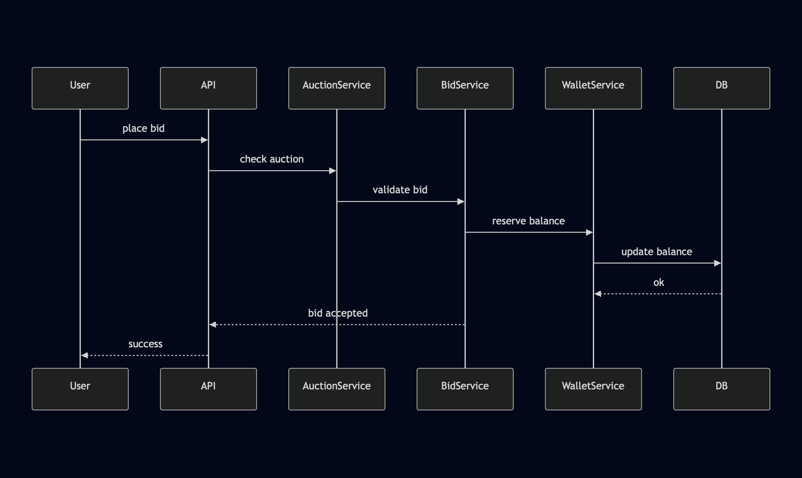
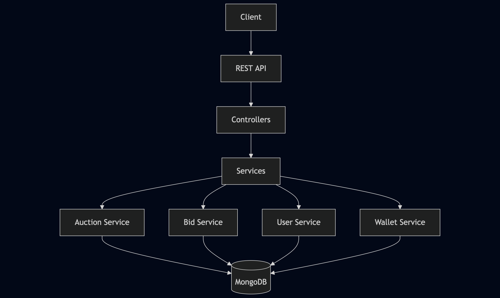

# Backend-аукцион цифровых подарков
## Telegram Gift Auctions

## Общее описание

Данный репозиторий содержит серверную реализацию многораундового аукциона цифровых товаров, вдохновлённого механикой Telegram Gift Auctions.

Формат задачи изначально предполагает отсутствие подробного технического задания.
Цель реализации — не буквальное копирование поведения Telegram, а осмысленное воспроизведение ключевых продуктовых принципов аукционов:

- устойчивость к последним секундам (anti-sniping)
- многораундовое распределение ограниченного ресурса
- строгая финансовая корректность
- корректная работа при конкурентных запросах

Этот README фиксирует:
- понимание продуктовой механики аукциона
- архитектурные и технические решения
- допущения, сделанные при отсутствии формальной спецификации
- инструкции по локальному запуску и демонстрации

Документ намеренно описывает, почему система работает именно так, а не только как она реализована.

---

## 1. Понимание механики аукционов

### 1.1 Общая концепция

Аукцион представляет собой многораундовую систему распределения ограниченного количества цифровых предметов.

В отличие от классического аукциона с одним дедлайном и единственным победителем:
- предметов может быть несколько
- победители определяются поэтапно
- участники, не выигравшие в одном раунде, продолжают участие в следующих

Такой подход:
- снижает эффект последней секунды
- делает процесс более прозрачным
- стимулирует активное участие на протяжении всего аукциона

---

### 1.2 Раунды и жизненный цикл аукциона

Аукцион имеет следующие состояния:
- ACTIVE — аукцион принимает ставки, активен текущий раунд
- FINISHED — все предметы распределены, новые ставки невозможны

Каждый раунд:
- имеет собственный таймер roundEndsAt
- принимает ставки пользователей
- завершается отдельной процедурой финализации

После завершения раунда:
- определяется набор победителей
- часть предметов распределяется
- аукцион либо переходит в следующий раунд, либо завершается

Номер текущего раунда хранится явно и увеличивается после каждой финализации.

---

### 1.3 Модель ставок

Ставка — это абсолютное значение, которое пользователь готов заплатить за предмет в конкретном раунде.

Каждая ставка связана с:
- пользователем
- аукционом
- номером раунда

Ожидается не более одной активной ставки от пользователя в рамках одного раунда.

#### Статусы ставок

- ACTIVE — участвует в ранжировании
- WON — ставка выиграла предмет
- LOST — ставка проиграла и подлежит возврату средств

---

### 1.4 Ранжирование и определение победителей

При финализации раунда:
1. Выбираются все активные ставки текущего раунда
2. Ставки сортируются по сумме (по убыванию), затем по времени создания
3. Победителями становятся первые N ставок, где  
   N = min(remainingItems, itemsAllocatedInThisRound)

Каждый победитель получает ровно один предмет.
Оставшиеся активные ставки помечаются как проигравшие.

---

### 1.5 Anti-sniping

Если ставка поступает в течение заданного окна до окончания раунда, время завершения раунда автоматически продлевается.

---

### 1.6 Финансовая модель

Используется двухфазная модель баланса:
- balance — доступные средства пользователя
- heldBalance — средства, зарезервированные активными ставками

При размещении или повышении ставки:
- из balance списывается только разница
- средства переводятся в heldBalance

При финализации раунда:
- для WON ставок средства списываются окончательно
- для LOST ставок средства возвращаются в balance

Все операции выполняются внутри транзакций MongoDB.

---

## 2. Явные допущения

- Пользователь может выиграть не более одного предмета за раунд
- Ставка всегда относится к конкретному раунду
- Средства блокируются в момент ставки
- Anti-sniping продлевает раунд глобально
- Ранжирование ставок детерминировано

---

## 3. Архитектура и структура проекта

### Технологический стек

- Node.js + TypeScript
- MongoDB
- Mongoose

---

## 4. Запуск проекта

### Переменные окружения

PORT=3000  
MONGO_URL=mongodb://localhost:27017/auction

### Локальный запуск

npm install  
npm run dev

Сервер будет доступен по адресу  
http://localhost:3000

---

## 5. HTTP API

### Пользователи
- POST /api/users
- GET /api/users

### Аукционы
- POST /api/auctions
- GET /api/auctions

### Ставки
- POST /api/bids
- GET /api/bids

---

## 6. Итог

Проект демонстрирует продуктовый подход к backend-разработке, аккуратную работу с финансами и устойчивость к конкурентным запросам.

---

## 7. Решаемые проблемы и принятые решения

### Какие проблемы решались
В рамках проекта основной фокус был на решении нетривиальных задач backend-разработки:

- Реализация **сложной бизнес-логики аукциона**, включая многораундовую модель и механизм anti-sniping.
- Обеспечение **корректной работы с балансом пользователей** при размещении ставок.
- Предотвращение некорректных действий, таких как ставки в неактивных аукционах или при недостаточном балансе.
- Построение архитектуры, которая остаётся **понятной, расширяемой и поддерживаемой** по мере роста проекта.

### Выбор решений и архитектуры
- Была выбрана **слоистая архитектура** (controllers + services), чтобы отделить обработку HTTP-запросов от бизнес-логики.
- Основная логика вынесена в **отдельные сервисы** (AuctionService, BidService, WalletService), что снижает связанность кода и упрощает поддержку.
- **MongoDB** использована как основная база данных благодаря гибкости схемы и удобству для прототипирования.
- Реализована логика **резервирования средств**, позволяющая безопасно блокировать баланс пользователя на время активной ставки.
- Механизм **anti-sniping** продлевает раунд аукциона при ставках в последние секунды, делая процесс более честным для всех участников.

---

## Возможные улучшения / Next Steps

При дальнейшем развитии проекта можно реализовать следующие улучшения:

- Добавить **unit- и integration-тесты** для ключевой бизнес-логики.
- Использовать **транзакции MongoDB** для повышения надёжности при конкурентных операциях.
- Реализовать **аутентификацию и авторизацию** пользователей.
- Добавить **real-time обновления** состояния аукциона (например, с помощью WebSocket).
- Улучшить процесс развёртывания с помощью **Docker** и конфигураций окружения.
- Оптимизировать производительность для сценариев с большим количеством одновременных ставок.

